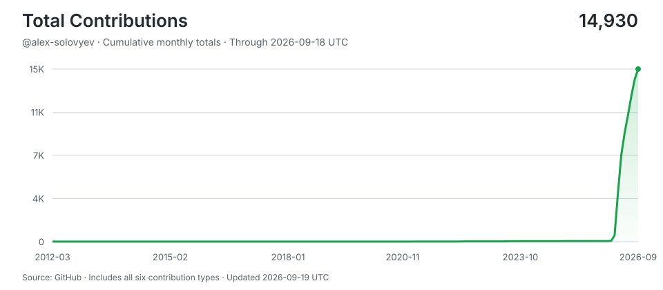

# alex-solovyev

> Shipping with AI agents around the clock -- human hours for thinking, machine hours for doing.
>
> Stats auto-updated by [aidevops](https://aidevops.sh).

<!-- STATS-START -->
## Work with AI

| Metric | Yesterday | Prior 7 Days | Prior 28 Days | Prior 365 Days |
| --- | ---: | ---: | ---: | ---: |
| Screen time (Linux) | 24h | 168h | 672h | ~8719h* |
| Interactive human attention | 11.5h | 45.4h | 144.3h | 238.9h |
| Interactive AI generation | 8.2h | 29.1h | 113.6h | 288.1h |
| Worker-classified human attention | 1.0h | 7.6h | 23.3h | 30.0h |
| Worker/headless AI generation | 1.4h | 39.1h | 105.7h | 1742.0h |
| Additive observed work | 21.9h | 120.8h | 383.8h | 2,293.7h |
| Interactive sessions | 6 | 10 | 41 | 85 |
| Worker sessions | 100 | 546 | 2,137 | 12,208 |

_Screen time from linux-wtmp:login-session-proxy; collection status: ok. *365-day estimate uses observed calendar coverage._

_Periods are completed local calendar days ending at midnight; today is excluded._

_Human attention is unioned wall-clock time, so overlapping sessions are not double-counted. AI generation is additive machine work across sessions; it is not wall-clock concurrency._

_AI session 365-day totals cover 172 days of local assistant session history (not extrapolated)._

## AI Model Usage (last 30 days)

| Model | Requests | Input | Output | Cache read | Cache Hit-Rate % | Session Count | Session Hours |
| --- | ---: | ---: | ---: | ---: | ---: | ---: | ---: |
| gpt-5.6-terra | 14,816 | 69.6M | 3.4M | 865.3M | 92.5% | 1,051 | 87.3h |
| gpt-5.5 | 5,821 | 33.8M | 1.7M | 711.9M | 95.5% | 32 | 71.6h |
| gpt-5.6-sol | 2,745 | 9.7M | 490K | 190.0M | 95.1% | 134 | 13.0h |
| gpt-6-astra | 2,371 | 11.3M | 427K | 388.8M | 97.2% | 44 | 13.1h |
| gpt-5.6-luna | 1,812 | 17.9M | 273K | 100.5M | 84.8% | 977 | 6.2h |
| **Total** | **27,565** | **142.5M** | **6.3M** | **2,256.7M** | **94.1%** | **2,235** | **191.2h** |

_2,405.6M total tokens processed. 94.1% cache hit rate._

## AI Model Usage (all time)

| Model | Requests | Input | Output | Cache read | Cache Hit-Rate % | Session Count | Session Hours |
| --- | ---: | ---: | ---: | ---: | ---: | ---: | ---: |
| gpt-5.5 | 148,841 | 710.0M | 27.8M | 11,709.9M | 94.3% | 4,714 | 1,053.4h |
| claude-opus-4-6 | 81,888 | 259.0M | 26.4M | 7,484.0M | 96.7% | 2,397 | 384.7h |
| claude-sonnet-4-6 | 71,313 | 148.9M | 22.0M | 6,176.0M | 97.6% | 1,285 | 276.6h |
| gpt-5.6-sol | 19,657 | 78.9M | 4.1M | 1,527.4M | 95.1% | 850 | 111.4h |
| gpt-5.6-terra | 15,892 | 73.7M | 3.6M | 917.3M | 92.6% | 1,151 | 92.0h |
| gemini-3-flash | 4,744 | 74.7M | 1.6M | 481.6M | 86.6% | 96 | 19.1h |
| claude-opus-4-7 | 3,029 | 4K | 1.4M | 435.5M | 100.0% | 24 | 16.5h |
| gpt-6-astra | 2,371 | 11.3M | 427K | 388.8M | 97.2% | 44 | 13.1h |
| gpt-5.6-luna | 2,279 | 22.7M | 303K | 105.0M | 82.2% | 1,359 | 7.1h |
| gpt-5.4-mini | 1,451 | 6.0M | 181K | 77.4M | 92.7% | 276 | 5.3h |
| claude-haiku-4-5 | 928 | 1K | 204K | 78.4M | 100.0% | 20 | 3.2h |
| big-pickle | 88 | 157K | 15K | 4.5M | 96.6% | 4 | 0.1h |
| claude-sonnet-4 | 87 | 158 | 26K | 6.7M | 100.0% | 2 | 0.2h |
| gemini-3.1-pro | 27 | 0 | 0 | 0 | 0.0% | 27 | 0.0h |
| claude-sonnet-4-5 | 16 | 67 | 4K | 1.7M | 100.0% | 2 | 0.0h |
| **Total** | **352,611** | **1,385.9M** | **88.4M** | **29,394.7M** | **95.5%** | **12,225** | **1,982.7h** |

_31,514.2M total tokens processed. 95.5% cache hit rate._
<!-- STATS-END -->

## Projects

- **[task-manager-python](https://github.com/alex-solovyev/task-manager-python)** -- No description
<!-- CONTRIBUTIONS-START -->
## Contributions

- **[aidevops](https://github.com/marcusquinn/aidevops)** -- Vibe-Coding is easy. DevOps is hard. AI DevOps automates your software, business, and personal development with managed infrastructure through AI chat in OpenCode. Opinionated tools, services, CLI & API tech-stack — for speed, security, and 24/7 results. Open-source-preferred, and SOTA everything.
- **[jquery-ui](https://github.com/jquery/jquery-ui)** -- The official jQuery user interface library.
- **[openwrt-slide-switch](https://github.com/jefferyto/openwrt-slide-switch)** -- Translate slide switch position changes into normal button presses
- **[quickfile-mcp](https://github.com/marcusquinn/quickfile-mcp)** -- MCP server for QuickFile UK accounting software - invoices, clients, purchases, banking, and reports
- **[ru-study-python](https://github.com/dualboot-partners/eu-python-learn-challenge)** -- No description
- **[shadowsocks](https://github.com/shadowsocks/shadowsocks)** -- No description
- **[tambo](https://github.com/tambo-ai/tambo)** -- Generative UI SDK for React
- **[wordpress-cd](https://github.com/rossigee/wordpress-cd)** -- No description
- **[wordpress-cd-s3](https://github.com/rossigee/wordpress-cd-s3)** -- Wordpress CD driver to deploy WP artifacts to S3 buckets.
- **[yc-remote-dev](https://github.com/MrRTi/yc-remote-dev)** -- Terraform config for remote dev environment at Yandex Cloud
<!-- CONTRIBUTIONS-END -->

## Connect

---

<!-- UPDATED-START -->
_Stats auto-updated 2026-09-12 20:13 UTC by [aidevops](https://aidevops.sh) pulse._
<!-- UPDATED-END -->

<!-- TOTAL-CONTRIBUTIONS-START -->

  <a href="https://commit-history.com/alex-solovyev?metric=total" target="_blank" rel="noopener noreferrer">
    <picture>
      <source media="(prefers-color-scheme: dark)" srcset="assets/contributions/total-dark.svg" />
      
    </picture>
  </a>

[Verify on commit-history.com](https://commit-history.com/alex-solovyev?metric=total) · [Chart data](assets/contributions/total.json)

Includes commits, issues, pull requests, reviews, repositories, and restricted contributions. Refreshed daily through the prior UTC day; commit-history.com may use a different refresh cutoff. GitHub controls link navigation—Ctrl/Cmd-click opens verification in a new tab.
<!-- TOTAL-CONTRIBUTIONS-END -->
