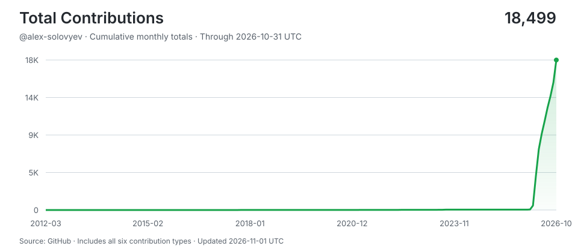

# alex-solovyev

> Shipping with AI agents around the clock -- human hours for thinking, machine hours for doing.
>
> Stats auto-updated by [aidevops](https://aidevops.sh).

<!-- STATS-START -->
## Work with AI

| Metric | Yesterday | Prior 7 Days | Prior 28 Days | Prior 365 Days |
| --- | ---: | ---: | ---: | ---: |
| Screen time (Linux) | 0.5h | 5.1h | 5.1h | unavailable |
| Interactive human attention | 0.0h | 17.7h | 156.7h | 501.4h |
| Interactive AI generation | 7.7h | 36.1h | 269.4h | 943.1h |
| Worker-classified human attention | 2.5h | 44.2h | 129.0h | 182.3h |
| Worker/headless AI generation | 30.7h | 151.1h | 482.4h | 2373.4h |
| Additive observed work | 40.9h | 246.5h | 1,008.4h | 3,960.3h |
| Interactive sessions | 3 | 20 | 151 | 312 |
| Worker sessions | 375 | 1,260 | 3,472 | 17,053 |

_Screen time from linux-input-activity:idle-cutoff-300s; collection status: ok, unavailable (fewer-than-7-sampled-days). Input sampling began 2026-11-04 (2.3 of 28 days sampled); earlier days are not counted._

_Periods are completed local calendar days ending at midnight; today is excluded._

_Human attention is unioned wall-clock time, so overlapping sessions are not double-counted. AI generation is additive machine work across sessions; it is not wall-clock concurrency._

_AI session 365-day totals cover 228 days of local assistant session history (not extrapolated)._

## AI Model Usage (last 30 days)

| Model | Requests | Input | Output | Cache read | Cache write | Cache Hit-Rate % | Session Count | Session Hours |
| --- | ---: | ---: | ---: | ---: | ---: | ---: | ---: | ---: |
| claude-sonnet-5-5 | 97,534 | 206K | 36.3M | 12,480.0M | 692.1M | 94.7% | 2,993 | 468.5h |
| claude-opus-5-5 | 32,026 | 66K | 10.6M | 4,506.8M | 141.2M | 97.0% | 578 | 213.9h |
| claude-haiku-4-5 | 2,719 | 14K | 1.2M | 235.8M | 58.0M | 80.2% | 3 | 6.1h |
| gpt-6.1-sol | 28 | 0 | 0 | 0 | 0 | 0.0% | 28 | 0.0h |
| gpt-6-luna | 16 | 0 | 0 | 0 | 0 | 0.0% | 16 | 0.0h |
| claude-haiku-5-5 | 4 | 16 | 787 | 0 | 188K | 0.0% | 4 | 0.0h |
| **Total** | **132,327** | **287K** | **48.2M** | **17,222.7M** | **891.6M** | **95.1%** | **3,507** | **688.6h** |

_18,162.9M total tokens processed. 95.1% cache hit rate._

## AI Model Usage (all time)

| Model | Requests | Input | Output | Cache read | Cache write | Cache Hit-Rate % | Session Count | Session Hours |
| --- | ---: | ---: | ---: | ---: | ---: | ---: | ---: | ---: |
| gpt-5.5 | 153,150 | 723.4M | 28.7M | 12,312.2M | 0 | 94.5% | 4,722 | 1,254.7h |
| claude-sonnet-5-5 | 114,356 | 242K | 42.5M | 14,600.9M | 804.0M | 94.8% | 3,479 | 575.7h |
| claude-opus-4-6 | 81,888 | 259.0M | 26.4M | 7,484.0M | 479.1M | 91.0% | 2,397 | 384.7h |
| claude-sonnet-4-6 | 71,445 | 148.9M | 22.0M | 6,185.6M | 137.2M | 95.6% | 1,290 | 277.0h |
| claude-opus-5-5 | 37,465 | 78K | 12.4M | 5,246.5M | 166.4M | 96.9% | 660 | 282.7h |
| gpt-5.6-sol | 25,047 | 97.6M | 4.8M | 2,025.2M | 0 | 95.4% | 1,075 | 137.5h |
| gpt-5.6-terra | 17,326 | 82.0M | 3.9M | 1,017.7M | 0 | 92.5% | 1,258 | 99.0h |
| gpt-6-sol | 5,076 | 17.8M | 654K | 337.9M | 0 | 95.0% | 277 | 27.0h |
| gemini-3-flash | 4,744 | 74.7M | 1.6M | 481.6M | 0 | 86.6% | 96 | 19.1h |
| gpt-6-astra | 4,262 | 20.3M | 718K | 751.4M | 0 | 97.4% | 49 | 64.4h |
| claude-haiku-4-5 | 3,805 | 16K | 1.5M | 328.8M | 61.9M | 84.1% | 24 | 11.1h |
| claude-opus-4-7 | 3,029 | 4K | 1.4M | 435.5M | 25.9M | 94.4% | 24 | 16.5h |
| gpt-5.6-luna | 2,488 | 26.6M | 312K | 107.1M | 0 | 80.1% | 1,526 | 7.4h |
| gpt-5.4-mini | 1,451 | 6.0M | 181K | 77.4M | 0 | 92.7% | 276 | 5.3h |
| big-pickle | 88 | 157K | 15K | 4.5M | 344K | 90.1% | 4 | 0.1h |
| claude-sonnet-4 | 87 | 158 | 26K | 6.7M | 177K | 97.4% | 2 | 0.2h |
| gpt-6-luna | 43 | 374K | 5K | 0 | 0 | 0.0% | 29 | 0.1h |
| gpt-6.1-sol | 32 | 0 | 0 | 0 | 0 | 0.0% | 32 | 0.0h |
| gemini-3.1-pro | 27 | 0 | 0 | 0 | 0 | 0.0% | 27 | 0.0h |
| claude-sonnet-4-5 | 17 | 70 | 4K | 1.7M | 413K | 80.6% | 3 | 0.0h |
| claude-haiku-5-5 | 4 | 16 | 787 | 0 | 188K | 0.0% | 4 | 0.0h |
| **Total** | **525,830** | **1,457.6M** | **147.7M** | **51,405.3M** | **1,675.8M** | **94.3%** | **17,080** | **3,162.4h** |

_54,686.7M total tokens processed. 94.3% cache hit rate._
<!-- STATS-END -->

<!-- PROJECTS-START -->
## Projects

- **[task-manager-python](https://github.com/alex-solovyev/task-manager-python)** -- No description
<!-- PROJECTS-END -->

<!-- CONTRIBUTIONS-START -->
## Contributions

- **[aidevops](https://github.com/marcusquinn/aidevops)** -- Vibe-Coding is easy. DevOps is hard. AI DevOps automates your software, business, and personal development with managed infrastructure through AI chat in OpenCode. Opinionated tools, services, CLI & API tech-stack — for speed, security, and 24/7 results. Open-source-preferred, and SOTA everything.
- **[jquery-ui](https://github.com/jquery/jquery-ui)** -- The official jQuery user interface library.
- **[openwrt-slide-switch](https://github.com/jefferyto/openwrt-slide-switch)** -- Translate slide switch position changes into normal button presses
- **[quickfile-mcp](https://github.com/marcusquinn/quickfile-mcp)** -- MCP server for QuickFile UK accounting software - invoices, clients, purchases, banking, and reports
- **[ru-study-python](https://github.com/dualboot-partners/eu-python-learn-challenge)** -- No description
- **[shadowsocks](https://github.com/shadowsocks/shadowsocks)** -- No description
- **[tambo](https://github.com/tambo-ai/tambo)** -- Generative UI SDK for React
- **[wordpress-cd](https://github.com/rossigee/wordpress-cd)** -- No description
- **[wordpress-cd-s3](https://github.com/rossigee/wordpress-cd-s3)** -- Wordpress CD driver to deploy WP artifacts to S3 buckets.
- **[yc-remote-dev](https://github.com/MrRTi/yc-remote-dev)** -- Terraform config for remote dev environment at Yandex Cloud
<!-- CONTRIBUTIONS-END -->

## Connect

---

<!-- UPDATED-START -->
_Stats auto-updated 2026-11-07 18:50 UTC by [aidevops](https://aidevops.sh) pulse._
<!-- UPDATED-END -->

<!-- TOTAL-CONTRIBUTIONS-START -->

  <a href="https://commit-history.com/alex-solovyev?metric=total" target="_blank" rel="noopener noreferrer">
    <picture>
      <source media="(prefers-color-scheme: dark)" srcset="assets/contributions/total-dark.svg" />
      
    </picture>
  </a>

[Verify on commit-history.com](https://commit-history.com/alex-solovyev?metric=total) · [Chart data](assets/contributions/total.json)

Includes commits, issues, pull requests, reviews, repositories, and restricted contributions. Refreshed daily through the prior UTC day; commit-history.com may use a different refresh cutoff. GitHub controls link navigation—Ctrl/Cmd-click opens verification in a new tab.
<!-- TOTAL-CONTRIBUTIONS-END -->
