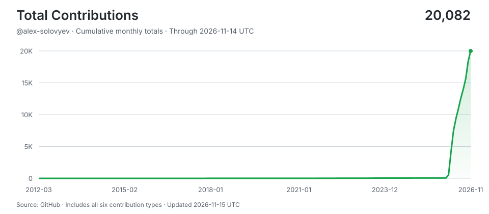

# alex-solovyev

> Shipping with AI agents around the clock -- human hours for thinking, machine hours for doing.
>
> Stats auto-updated by [aidevops](https://aidevops.sh).

<!-- STATS-START -->
## Work with AI

| Metric | Yesterday | Prior 7 Days | Prior 28 Days | Prior 365 Days |
| --- | ---: | ---: | ---: | ---: |
| Input activity (Linux) | 6.6h | 17.7h | 86.5h | ~1416h* |
| Interactive human attention | 4.5h | 11.8h | 76.3h | 549.6h |
| Interactive AI generation | 12.7h | 26.2h | 151.8h | 1057.8h |
| Worker-classified human attention | 0.3h | 5.5h | 59.8h | 196.0h |
| Worker/headless AI generation | 63.6h | 364.5h | 792.8h | 3008.0h |
| Additive observed work | 81.1h | 408.0h | 1,077.6h | 4,771.3h |
| Interactive sessions | 10 | 31 | 76 | 364 |
| Worker sessions | 451 | 1,576 | 4,370 | 20,092 |

_Input activity from linux-input-activity:idle-cutoff-300s; collection status: ok. Input sampling began 2026-11-04 (22.3 of 28 days sampled); earlier days are not counted. Latest sample measured: terminal input only; no desktop session on this host. *365-day estimate uses observed calendar coverage._

_Periods are completed local calendar days ending at midnight; today is excluded._

_Human attention is unioned wall-clock time, so overlapping sessions are not double-counted. AI generation is additive machine work across sessions; it is not wall-clock concurrency._

_AI session 365-day totals cover 248 days of local assistant session history (not extrapolated)._

## AI Model Usage (last 30 days)

| Model | Requests | Input | Output | Cache read | Cache write | Cache Hit-Rate % | Session Count | Session Hours |
| --- | ---: | ---: | ---: | ---: | ---: | ---: | ---: | ---: |
| claude-sonnet-5-5 | 133,556 | 278K | 45.9M | 18,083.8M | 708.0M | 96.2% | 3,624 | 817.6h |
| claude-opus-5-5 | 21,189 | 44K | 7.2M | 3,067.2M | 100.6M | 96.8% | 282 | 158.3h |
| claude-haiku-4-5 | 3,929 | 20K | 2.7M | 383.5M | 49.0M | 88.7% | 3 | 21.8h |
| claude-haiku-5-5 | 718 | 2K | 145K | 27.9M | 34.3M | 44.8% | 435 | 16.7h |
| gpt-6.1-sol | 8 | 0 | 0 | 0 | 0 | 0.0% | 8 | 0.0h |
| gpt-6-luna | 1 | 0 | 0 | 0 | 0 | 0.0% | 1 | 0.0h |
| **Total** | **159,401** | **346K** | **56.0M** | **21,562.6M** | **892.0M** | **96%** | **4,284** | **1,014.5h** |

_22,511.0M total tokens processed. 96% cache hit rate._

## AI Model Usage (all time)

| Model | Requests | Input | Output | Cache read | Cache write | Cache Hit-Rate % | Session Count | Session Hours |
| --- | ---: | ---: | ---: | ---: | ---: | ---: | ---: | ---: |
| claude-sonnet-5-5 | 213,242 | 447K | 75.5M | 28,275.9M | 1,291.1M | 95.6% | 5,915 | 1,222.5h |
| gpt-5.5 | 153,150 | 723.4M | 28.7M | 12,312.2M | 0 | 94.5% | 4,722 | 1,254.7h |
| claude-opus-4-6 | 81,888 | 259.0M | 26.4M | 7,484.0M | 479.1M | 91.0% | 2,397 | 384.7h |
| claude-sonnet-4-6 | 71,445 | 148.9M | 22.0M | 6,185.6M | 137.2M | 95.6% | 1,290 | 277.0h |
| claude-opus-5-5 | 46,011 | 96K | 15.2M | 6,439.9M | 211.2M | 96.8% | 777 | 353.3h |
| gpt-5.6-sol | 25,047 | 97.6M | 4.8M | 2,025.2M | 0 | 95.4% | 1,075 | 137.5h |
| gpt-5.6-terra | 17,326 | 82.0M | 3.9M | 1,017.7M | 0 | 92.5% | 1,258 | 99.0h |
| claude-haiku-4-5 | 6,242 | 28K | 3.4M | 582.3M | 81.7M | 87.7% | 24 | 28.8h |
| gpt-6-sol | 5,076 | 17.8M | 654K | 337.9M | 0 | 95.0% | 277 | 27.0h |
| gemini-3-flash | 4,744 | 74.7M | 1.6M | 481.6M | 0 | 86.6% | 96 | 19.1h |
| gpt-6-astra | 4,262 | 20.3M | 718K | 751.4M | 0 | 97.4% | 49 | 64.4h |
| claude-opus-4-7 | 3,029 | 4K | 1.4M | 435.5M | 25.9M | 94.4% | 24 | 16.5h |
| gpt-5.6-luna | 2,488 | 26.6M | 312K | 107.1M | 0 | 80.1% | 1,526 | 7.4h |
| gpt-5.4-mini | 1,451 | 6.0M | 181K | 77.4M | 0 | 92.7% | 276 | 5.3h |
| claude-haiku-5-5 | 719 | 2K | 145K | 27.9M | 34.4M | 44.8% | 436 | 16.7h |
| big-pickle | 88 | 157K | 15K | 4.5M | 344K | 90.1% | 4 | 0.1h |
| claude-sonnet-4 | 87 | 158 | 26K | 6.7M | 177K | 97.4% | 2 | 0.2h |
| gpt-6-luna | 43 | 374K | 5K | 0 | 0 | 0.0% | 29 | 0.1h |
| gpt-6.1-sol | 39 | 0 | 0 | 0 | 0 | 0.0% | 39 | 0.0h |
| gemini-3.1-pro | 27 | 0 | 0 | 0 | 0 | 0.0% | 27 | 0.0h |
| claude-sonnet-4-5 | 17 | 70 | 4K | 1.7M | 413K | 80.6% | 3 | 0.0h |
| **Total** | **636,421** | **1,457.9M** | **185.6M** | **66,555.1M** | **2,261.8M** | **94.7%** | **20,046** | **3,914.2h** |

_70,460.4M total tokens processed. 94.7% cache hit rate._
<!-- STATS-END -->

<!-- PROJECTS-START -->
## Projects

- **[task-manager-python](https://github.com/alex-solovyev/task-manager-python)** -- No description
<!-- PROJECTS-END -->

<!-- CONTRIBUTIONS-START -->
## Contributions

- **[aidevops](https://github.com/marcusquinn/aidevops)** -- Vibe-Coding is easy. DevOps is hard. AI DevOps automates your software, business, and personal development with managed infrastructure through AI chat in OpenCode. Opinionated tools, services, CLI & API tech-stack — for speed, security, and 24/7 results. Open-source-preferred, and SOTA everything.
- **[jquery-ui](https://github.com/jquery/jquery-ui)** -- The official jQuery user interface library.
- **[openwrt-slide-switch](https://github.com/jefferyto/openwrt-slide-switch)** -- Translate slide switch position changes into normal button presses
- **[quickfile-mcp](https://github.com/marcusquinn/quickfile-mcp)** -- MCP server for QuickFile UK accounting software - invoices, clients, purchases, banking, and reports
- **[ru-study-python](https://github.com/dualboot-partners/eu-python-learn-challenge)** -- No description
- **[shadowsocks](https://github.com/shadowsocks/shadowsocks)** -- No description
- **[tambo](https://github.com/tambo-ai/tambo)** -- Generative UI SDK for React
- **[wordpress-cd](https://github.com/rossigee/wordpress-cd)** -- No description
- **[wordpress-cd-s3](https://github.com/rossigee/wordpress-cd-s3)** -- Wordpress CD driver to deploy WP artifacts to S3 buckets.
- **[yc-remote-dev](https://github.com/MrRTi/yc-remote-dev)** -- Terraform config for remote dev environment at Yandex Cloud
<!-- CONTRIBUTIONS-END -->

## Connect

---

<!-- UPDATED-START -->
_Stats auto-updated 2026-11-27 11:04 UTC by [aidevops](https://aidevops.sh) pulse._
<!-- UPDATED-END -->

<!-- TOTAL-CONTRIBUTIONS-START -->

  <a href="https://commit-history.com/alex-solovyev?metric=total" target="_blank" rel="noopener noreferrer">
    <picture>
      <source media="(prefers-color-scheme: dark)" srcset="assets/contributions/total-dark.svg" />
      
    </picture>
  </a>

[Verify on commit-history.com](https://commit-history.com/alex-solovyev?metric=total) · [Chart data](assets/contributions/total.json)

Includes commits, issues, pull requests, reviews, repositories, and restricted contributions. Refreshed daily through the prior UTC day; commit-history.com may use a different refresh cutoff. GitHub controls link navigation—Ctrl/Cmd-click opens verification in a new tab.
<!-- TOTAL-CONTRIBUTIONS-END -->
